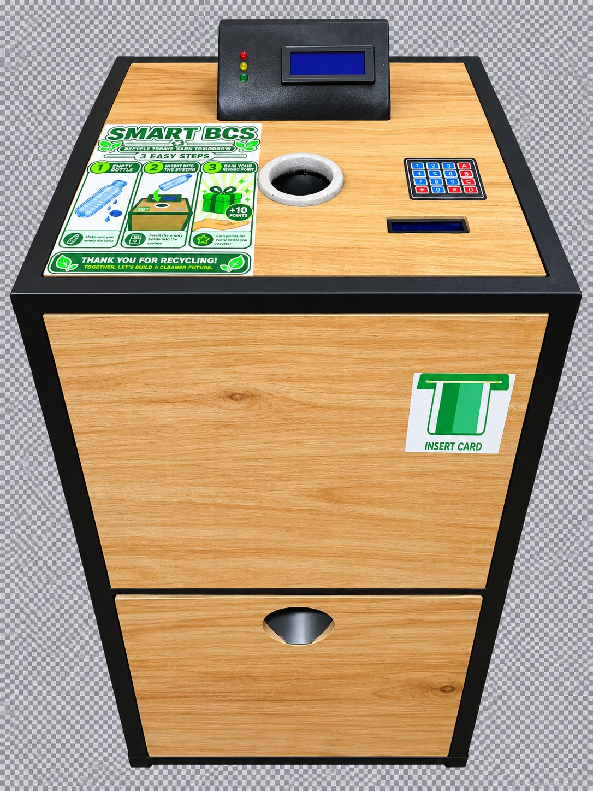

# ♻️ SMART BCS — Smart Bottle Collection System
<p align="center">
  
</p>

> An intelligent ESP32-based plastic bottle collection and reward system that combines automated bottle verification, RFID identification, mechanical sorting, reward tracking, bin-level monitoring, and SMS receipts.

## 📌 Overview

**SMART BCS (Smart Bottle Collection System)** is a functional automated recycling system designed to encourage responsible plastic bottle disposal through intelligent verification and a reward-based approach.

The system accepts primarily **500 mL empty PET bottles**, verifies the bottle using weight measurement, automatically accepts or rejects it, rewards registered users with points, monitors the collection-bin level, and provides transaction feedback through LCD displays and SMS.

SMART BCS was designed, fabricated, programmed, integrated, and tested as an engineering project combining:

- Embedded systems
- Internet of Things (IoT)
- Sensors and instrumentation
- Mechanical automation
- RFID technology
- Wireless communication
- Human-machine interaction
- Sustainable waste management

---

## 🎯 The Problem

Plastic bottle waste remains a significant environmental challenge.

Although collection bins are widely available, conventional bins generally cannot:

- Identify users
- Verify deposited objects
- Automatically reject unsuitable bottles
- Reward users for recycling
- Track recycling activity
- Notify users of their transactions
- Detect when the collection bin is full

SMART BCS explores how embedded electronics and automation can make bottle collection more **interactive, intelligent, traceable, and rewarding**.

---

## 💡 The Solution

SMART BCS combines several subsystems into one automated bottle-collection platform.

A user can operate the system as either:

### Registered User

The user scans an RFID card before inserting bottles.

For every accepted bottle:

- The bottle is verified.
- The sorting mechanism directs it into the collection bin.
- **10 reward points** are added to the user's account.
- The balance is stored locally.
- A transaction receipt can be sent through SMS.

### Guest User

A person without an RFID card can select **Guest Mode** and recycle bottles without creating an account.

Bottle verification and automatic sorting remain active, but reward points are not assigned to an account.

---

## ⚙️ How SMART BCS Works

The basic operating sequence is:

```text
START
  │
  ▼
System Initialization
  │
  ▼
RFID User ──────── Guest Mode
  │                    │
  └─────────┬──────────┘
            ▼
       Insert Bottle
            │
            ▼
      Measure Weight
            │
            ▼
     Is Weight Between
        12 g – 30 g?
        /          \
      YES           NO
       │             │
       ▼             ▼
    ACCEPT         REJECT
       │             │
       ▼             ▼
 Servo Sorting   Return Bottle
       │
       ▼
 Award 10 Points
(Registered User)
       │
       ▼
 Store Balance
       │
       ▼
 Send SMS Receipt
       │
       ▼
 Monitor Bin Level
       │
       ▼
        END

🧠 Core Features
🪪 RFID User Identification

An MFRC522 RFID reader identifies registered users and links recycling transactions to their reward account.

⚖️ Bottle Weight Verification

A load cell and HX711 amplifier measure the inserted bottle.

The implemented acceptance range is approximately:

12 g ≤ Bottle Weight ≤ 30 g

This range was selected for the empty PET bottles targeted during development and testing.

🔄 Automatic Bottle Sorting

An MG996R servo motor operates the mechanical sorting mechanism.

Typical servo positions are:

Function	Angle
Accept	0°
Standby	90°
Reject	140°
🎁 Reward System

Registered users receive:

10 points per accepted bottle

Reward balances are stored using the ESP32's non-volatile storage so that accumulated points can survive a restart or loss of power.

📱 SMS Transaction Receipts

SMART BCS communicates with an SMS service through Wi-Fi.

Registered users can receive receipts containing information such as:

Bottles processed
Bottles accepted
Bottles rejected
Points earned
Total reward balance
📦 Bin-Level Monitoring

An HC-SR04 ultrasonic sensor monitors the bottle collection bin.

During practical testing, the full-bin detection region was approximately 17–20 cm, depending on how the collected bottles were positioned.

🖥️ User Interface

Two I²C LCD displays provide real-time instructions and transaction feedback.

LED indicators and a buzzer provide additional visual and audible feedback.

🔧 Hardware

The system integrates:

Component	Function
ESP32	Main system controller
MFRC522	RFID identification
RFID Card	Registered-user identification
Load Cell	Bottle weight measurement
HX711	Load-cell signal amplification
MG996R Servo	Bottle sorting
HC-SR04	Collection-bin level monitoring
20×4 I²C LCD	Main user interface
16×2 I²C LCD	Secondary user feedback
Keypad	User control
LEDs	System status indication
Buzzer	Audible feedback
Buck Converter	Voltage regulation
12 V Supply	Main external power source
🏗️ System Architecture
                         ┌──────────────┐
                         │    RFID      │
                         │   RC522      │
                         └──────┬───────┘
                                │
                                ▼
┌──────────────┐        ┌───────────────┐
│   Load Cell  │───────►│               │
│    + HX711   │        │               │
└──────────────┘        │     ESP32     │──────► LCD Displays
                        │               │
┌──────────────┐        │               │──────► LEDs / Buzzer
│  HC-SR04     │───────►│               │
└──────────────┘        └───────┬───────┘
                                │
                   ┌────────────┼────────────┐
                   ▼            ▼            ▼
               Servo Motor     Wi-Fi        NVS
                   │            │            │
                   ▼            ▼            ▼
             Bottle Sorting  SMS Service  User Points
🧪 Testing & Results

SMART BCS underwent repeated functional and operational testing.

Some recorded results include:

100+ Guest Mode transaction cycles
580 cumulative registered-user points
58 accepted registered bottle events
10 points awarded per accepted bottle
Tested empty bottle weights of approximately 16.2–27.02 g
36/36 displayed SMS messages successfully delivered
100% SMS delivery within the recorded dashboard sample
Practical full-bin detection around 17–20 cm

The system was also demonstrated to lecturers and students during its development.

🛠️ Engineering Challenges & Lessons Learned

Developing SMART BCS involved several iterations.

Servo Mechanical Binding

Early versions allowed the sorting servo to rotate close to 180°. This caused mechanical binding under certain conditions.

The reject position was subsequently reduced to approximately 140°, improving the movement of the sorting mechanism.

Power Stability

The system initially operated more reliably from laptop USB power than from the external supply.

This highlighted the importance of:

Proper voltage regulation
Servo current requirements
Common grounding
Power-supply decoupling
Separating high-current loads from sensitive electronics
Load-Cell Calibration

Reliable bottle classification required repeated calibration and testing of the load cell and HX711.

RFID Integration

RFID operation required additional work to achieve reliable card detection when integrated with the complete system.

Reliable SMS Handling

The communication system was designed to avoid treating an HTTP response alone as proof of successful SMS delivery.

Pending receipts can be retained when communication fails and retried when connectivity becomes available.

These challenges became an important part of the engineering development process.

🧰 Technologies Used
ESP32
Arduino IDE / Embedded C++
SPI
I²C
RFID
HX711 load-cell interface
Ultrasonic sensing
Servo control
Wi-Fi
HTTP/API communication
SMS communication
Non-volatile storage (NVS)
🌍 Potential Applications

SMART BCS could potentially be adapted for use in:

Universities and schools
Shopping centres
Offices
Public recycling stations
Events
Transportation terminals
Smart-city waste-management systems
Community recycling programmes
🚀 Future Development

Possible future improvements include:

Improved bottle/material identification
Computer vision
Barcode recognition
Cloud-based user accounts
Mobile application integration
QR-based user identification
Web-based recycling analytics
Solar-powered operation
Larger collection capacity
Multiple waste categories
Improved industrial enclosure
Automated reward redemption
Networked SMART BCS stations

The long-term direction is to develop SMART BCS into a more scalable platform for intelligent recycling and incentive-based waste collection.

🔐 Security & Privacy

Credentials used during development are not included in this repository.

The public source code should never contain:

Wi-Fi passwords
SMS API keys
Private phone numbers
Authentication tokens
Other sensitive credentials

Example:
const char* WIFI_SSID = "YOUR_WIFI_NAME";
const char* WIFI_PASSWORD = "YOUR_WIFI_PASSWORD";
const char* SMS_API_KEY = "PASTE_YOUR_API_KEY_HERE";

📸 Project Gallery

## 📸 Project Gallery

### Completed SMART BCS

<p align="center">
  
</p>

### Internal Structure

<p align="center">
  
</p>

### Internal Wiring

<p align="center">
  
</p>

### Servo Sorting Mechanism

<p align="center">
  
</p>

### RFID Testing

<p align="center">
  
</p>

### Load-Cell Testing

<p align="center">
  
</p>

### SMS Receipt

<p align="center">
  
</p>

🤝 Collaboration

I am interested in connecting with engineers, researchers, organizations, recycling companies, environmental groups, and technology partners interested in areas such as:

IoT • Embedded Systems • Automation • Smart Waste Management • Recycling Technology • Sustainability

Potential collaboration could include further engineering development, field testing, research, manufacturing, deployment, or scaling of the SMART BCS concept.

👨‍💻 Author

MARK VONOO

Engineering Student | Embedded Systems & IoT | Automation | Sustainable Technology

📍 Ghana

LinkedIn: [Add LinkedIn profile link](https://www.linkedin.com/in/mark-vonoo-67b017435?utm_source=share_via&utm_content=profile&utm_medium=member_ios)
Medium: Add Medium profile link
